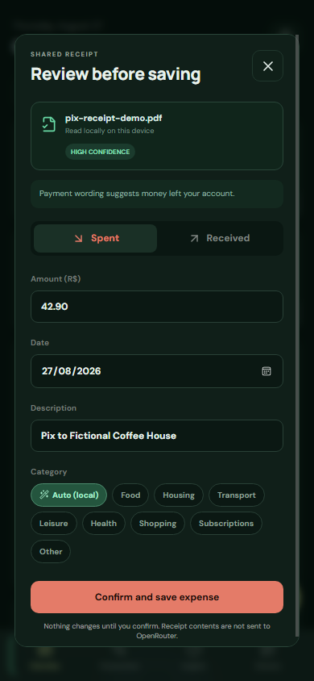

<div align="center">
  
  <h1>Leafy</h1>
  <p>A calm, local-first way to understand your money.</p>

  [](https://github.com/MusicMaster4/Leafy/actions/workflows/ci.yml)
  [](https://github.com/MusicMaster4/Leafy/releases)
  [](https://github.com/MusicMaster4/Leafy/actions/workflows/security.yml)
  
  
</div>


Leafy is a personal finance tracker for people who stop using finance trackers. Adding an expense takes a value, a short description, and one click. The dashboard does the rest.

Your ledger lives on your device. There is no Leafy account and no shared database. Local records are sealed with AES-256-GCM, while phone-to-computer sync combines end-to-end encryption with a short-lived, certificate-pinned TLS session.

## What works today

- One-step income and expense entry, also available with the `N` shortcut
- Balance, income, expenses, savings rate, and seven-day spending pace
- Encrypted currency preference with BRL as the default, plus USD, EUR, and GBP
- Line, bar, and category donut charts with 7, 30, and 90-day views
- Optional AI categorization through your own OpenRouter key
- Offline category matching when AI is unavailable
- Android Share Sheet import for PDF, image, and plain-text receipts
- On-device receipt OCR with a review step before any balance change
- Private desktop-to-phone pairing by QR code
- Responsive desktop and Android interface
- Stable releases from `main` and beta releases from `testing`

<table>
  <tr>
    <td width="58%"></td>
    <td width="21%"></td>
    <td width="21%"></td>
  </tr>
</table>

The screenshots use generated demo transactions. They contain no bank exports, API keys, pairing secrets, or personal financial data.

## Run Leafy

You need Node.js 22 or newer. Desktop and Android builds also need the [Tauri 2 prerequisites](https://v2.tauri.app/start/prerequisites/).

```bash
npm install
npm run dev
```

Open `http://localhost:1420` for the browser version.

Run the desktop app:

```bash
npm run tauri dev
```

Build an Android APK:

```bash
npm run tauri android init
npm run tauri android build -- --apk
```

## AI categorization

`Auto` is the default category. Leafy sends the transaction description to OpenRouter and accepts only one of the categories defined by the app. If the request fails or no key is configured, a small local ruleset makes the choice instead. Saving the transaction never depends on the network.

Connect a key from Preferences to keep it encrypted in this device's app data, or provide it before launch:

```powershell
$env:OPENROUTER_API_KEY="sk-or-v1-..."
npm run tauri dev
```

The raw key is not written to the repository, copied into pairing codes, sent to another device, or included in screenshots. When a paired phone needs AI categorization, it sends only the transaction description through the pinned private channel and the computer makes the OpenRouter request. The computer must be running and reachable. You can choose a different OpenRouter model with `LEAFY_OPENROUTER_MODEL`. The default is `openrouter/auto`.

## Share a receipt from Android

Open a Pix receipt, payment PDF, screenshot, or plain-text confirmation in another Android app and choose **Share → Leafy**. Leafy appears as a system share target, reads the document on the phone, and proposes:

- whether the money was spent or received
- the amount and transaction date
- a short description and local category

Leafy always opens a review screen. It never changes the balance from an imported file until you confirm. PDFs are rendered in a private temporary directory, images and PDF pages use the bundled on-device OCR model, and temporary files are deleted after processing. Receipt contents are not sent to OpenRouter; imported receipts use local category matching by default.

Incoming files are limited to 10 MB and 10 PDF pages. Leafy accepts secure Android `content://` shares for PDFs and images instead of requesting broad storage access.

The receipt currency must match the ledger currency selected in Preferences. Leafy warns and blocks confirmation on a mismatch instead of silently treating reais as dollars or guessing an exchange rate.

## Private device sync

The desktop app starts a one-hour HTTPS endpoint on a random port. It prefers the computer's Tailscale adapter, which keeps the endpoint reachable only according to that user's tailnet policy, and falls back to the local network. Its self-signed certificate is pinned directly from the QR code, so Leafy never disables certificate or hostname verification. The QR carries independent secrets for transport authentication and content encryption:

- a 256-bit AES-GCM key used before financial data leaves the device
- a separate 256-bit bearer token compared in constant time
- the ephemeral TLS certificate and a random session identifier

The encryption key is never sent in a network request. The native client accepts only `https://` endpoints on local/private addresses or Tailscale's `100.64.0.0/10` range, rejects redirects and public hosts, caps payload size, and binds ciphertext to its session with authenticated additional data. Pairing details, the ledger, preferences, and an optional OpenRouter key are encrypted locally with a non-exportable device key. In-place app updates keep this app-data store; legacy plaintext storage is removed after a successful migration.

If Windows Firewall was previously told to block `leafy-financas.exe`, an explicit block overrides every allow rule and the phone cannot connect. Run `scripts/configure-windows-tailscale-firewall.ps1` once from an elevated PowerShell prompt. It disables only TCP block rules for the installed Leafy executable and adds an inbound rule restricted to Tailscale's IPv4 range on private network profiles.

## Release channels

| Branch | Channel | Version shape | GitHub release |
| --- | --- | --- | --- |
| `main` | Stable | `vX.Y.Z` | Latest release |
| `testing` | Beta | `vX.Y.Z-testing.N` | Pre-release |

Only these branches publish builds. Every release includes Windows, macOS, Linux, and an installable Android APK. Pull requests and other branches run type checks, tests, the production web build, and a native Rust check without publishing anything.

## Checks

```bash
npm test
npm run build
cargo test --locked --manifest-path src-tauri/Cargo.toml
cargo check --locked --manifest-path src-tauri/Cargo.toml
```

## Project map

```text
src/                    React interface, receipt analysis, charts, finance logic, sync crypto
src-tauri/src/          Tauri commands, OpenRouter client, local sync server
src-tauri/gen/android/  Generated Android Studio project
scripts/                Branch-aware release versioning
.github/workflows/      CI and stable/beta release pipelines
```

## Privacy notes

Leafy does not connect to banks and does not upload a ledger to a Leafy service. OpenRouter receives only descriptions that you submit with `Auto` selected. Someone who can unlock or fully compromise your device can still access data the app can access, and anyone who photographs an active pairing QR can join that time-limited session. Treat the QR like a password and disconnect the device when you are done. See [SECURITY.md](SECURITY.md) for the threat model and private reporting process.

## Contributing

Bug reports and focused pull requests are welcome. Run the three checks above before opening a PR. Please do not include real bank statements, API keys, or screenshots with personal data in issues.

Built with [Tauri](https://tauri.app/), [React](https://react.dev/), [Recharts](https://recharts.org/), and [OpenRouter](https://openrouter.ai/).
