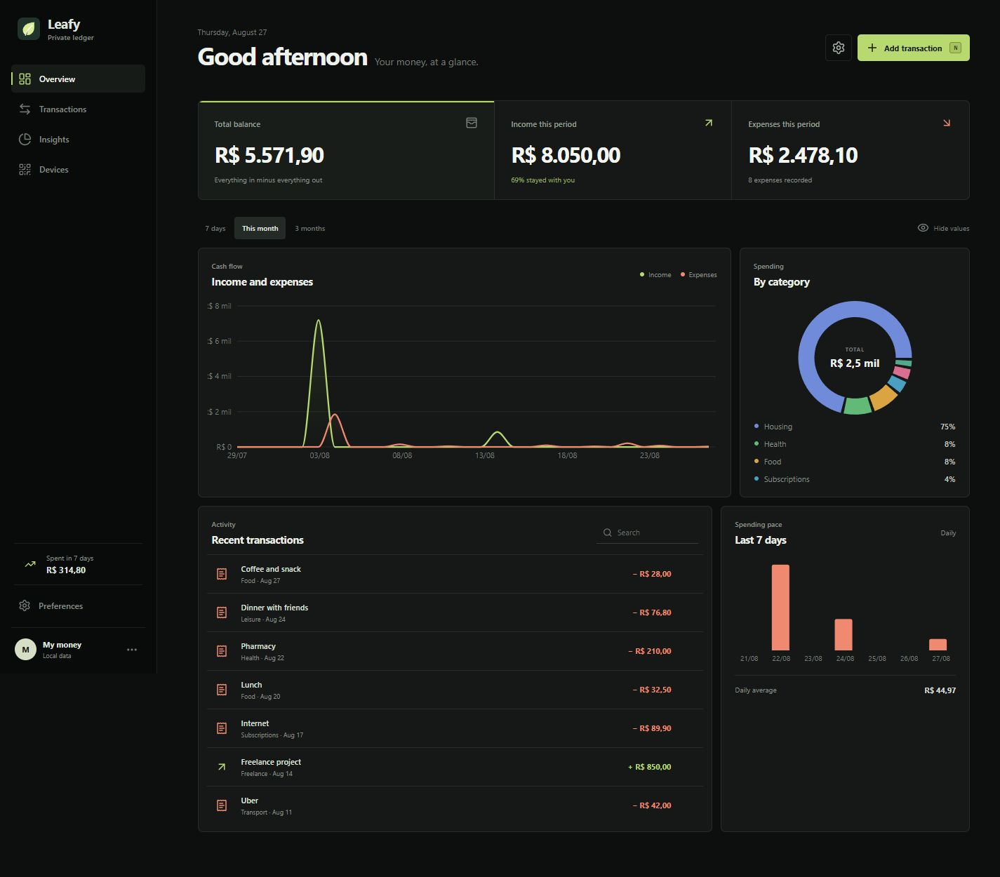
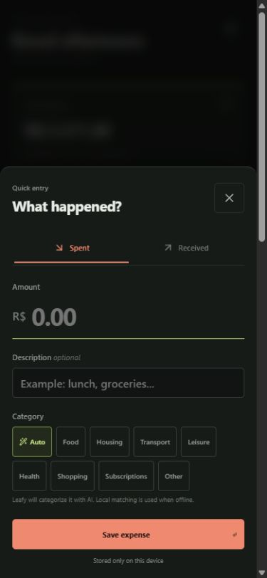
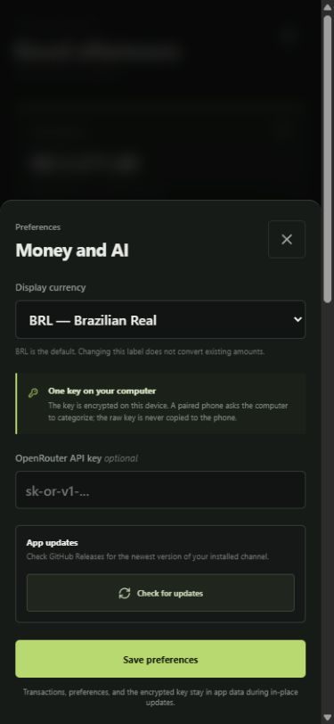

<div align="center">
  
  <h1>Leafy</h1>
  <p>A private money tracker that stays out of your way.</p>

  [](https://github.com/MusicMaster4/Leafy/actions/workflows/ci.yml)
  [](https://github.com/MusicMaster4/Leafy/releases)
  [](https://github.com/MusicMaster4/Leafy/actions/workflows/security.yml)
  
  
</div>



Leafy is a local-first personal finance tracker for desktop and Android. Recording an expense takes an amount, a short description, and one click. The dashboard handles the totals, trends, and category breakdown.

There is no Leafy account or hosted ledger. Transactions and preferences stay on your device, sealed with AES-256-GCM. Pairing a phone with a computer creates a short-lived, certificate-pinned connection with separate keys for authentication and content encryption.

## What Leafy can do

- Record income and expenses quickly, with the `N` desktop shortcut
- Schedule monthly recurring expenses for automatic entry on a chosen day
- Show balance, cash flow, savings rate, categories, and seven-day spending pace
- Switch between 7, 30, and 90-day views
- Display BRL, USD, EUR, or GBP without pretending to convert historical values
- Categorize locally or through your own OpenRouter key
- Import Android receipts from PDFs, images, and plain text
- Read receipts on-device, then ask for confirmation before changing the ledger
- Pair desktop and Android by QR code over Tailscale or a local network
- Download and install signed updates from inside the app
- Keep a single desktop instance open when the shortcut is clicked repeatedly

<table>
  <tr>
    <td width="50%" align="center"><strong>Quick entry</strong></td>
    <td width="50%" align="center"><strong>Preferences and updates</strong></td>
  </tr>
  <tr>
    <td align="center"></td>
    <td align="center"></td>
  </tr>
</table>

The screenshots use generated demo transactions. They contain no bank exports, API keys, pairing secrets, or personal financial data.

## Download Leafy

Get the newest stable or beta build from [GitHub Releases](https://github.com/MusicMaster4/Leafy/releases). Releases include a Windows installer, macOS disk image, Linux packages, and an Android APK.

Leafy checks the channel that was installed. When a newer version is available, choose **Download and install** in the app. Desktop packages are signed and verified before installation; Android downloads the official APK and hands it to the system package installer. App data stays in place during an update.

On desktop, opening Leafy again restores and focuses the existing window instead of starting another copy.

## Run it locally

You need Node.js 22 or newer. Native desktop and Android builds also require the [Tauri 2 prerequisites](https://v2.tauri.app/start/prerequisites/).

```bash
npm install
npm run dev
```

Open `http://localhost:1420` for the browser version, or start the native desktop app:

```bash
npm run tauri dev
```

Build an Android APK:

```bash
npm run tauri android init
npm run tauri android build -- --apk
```

## AI categorization

`Auto` is the default category. Leafy sends only the transaction description to OpenRouter and accepts only a category that the app already knows. If the request fails or no key is configured, a small local ruleset chooses instead. Saving a transaction never depends on the network.

Add an OpenRouter key in Preferences to keep it encrypted in the app's private data, or provide it before launch:

```powershell
$env:OPENROUTER_API_KEY="sk-or-v1-..."
npm run tauri dev
```

The raw key is not committed, copied into pairing codes, sent to a paired phone, or included in screenshots. A paired phone sends the description through the private channel and the computer makes the OpenRouter request. The computer must be running and reachable. Set `LEAFY_OPENROUTER_MODEL` to choose a model; the default is `openrouter/auto`.

## Android receipt import

Open a Pix receipt, payment PDF, screenshot, or plain-text confirmation in another Android app and choose **Share → Leafy**. Leafy reads it locally and proposes the direction, amount, date, description, and category.

Nothing is saved until you confirm. PDFs are rendered in a private temporary directory, images and PDF pages use the bundled OCR model, and temporary files are removed after processing. Receipt contents do not go to OpenRouter.

Incoming files are limited to 10 MB and 10 PDF pages. Leafy accepts Android `content://` shares instead of asking for broad storage access. It also blocks confirmation when the receipt currency does not match the selected ledger currency.

## Private device sync

The desktop app opens a one-hour HTTPS endpoint on a random port. It prefers Tailscale and falls back to the local network. The phone pins the self-signed certificate carried by the QR code, so certificate verification is never disabled.

The QR code contains:

- a 256-bit AES-GCM key that encrypts financial data before it leaves the device
- a separate 256-bit bearer token compared in constant time
- the temporary TLS certificate and a random session identifier

The native client accepts only `https://` endpoints on local/private addresses or Tailscale's `100.64.0.0/10` range. It rejects redirects and public hosts, limits payload size, and binds ciphertext to its session with authenticated additional data.

If Windows Firewall has an explicit block rule for `leafy-financas.exe`, the phone cannot connect. Run `scripts/configure-windows-tailscale-firewall.ps1` once from an elevated PowerShell prompt. The script changes only TCP block rules for the installed Leafy executable and adds an inbound rule restricted to Tailscale IPv4 addresses on private network profiles.

## Release channels

| Branch | Channel | Version | GitHub release |
| --- | --- | --- | --- |
| `main` | Stable | `vX.Y.Z` | Latest release |
| `testing` | Beta | `vX.Y.Z-testing.N` | Pre-release |

Only `main` and `testing` publish builds. Each release carries the desktop installers, Android APK, signed updater artifacts, and update manifest. Pull requests and other branches run validation without publishing.

## Checks

```bash
npm test
npm run build
cargo test --locked --manifest-path src-tauri/Cargo.toml
cargo check --locked --manifest-path src-tauri/Cargo.toml
```

## Project map

```text
src/                    React interface, receipt analysis, charts, finance logic, sync crypto
src-tauri/src/          Tauri commands, updater, OpenRouter client, local sync server
src-tauri/gen/android/  Generated Android Studio project
scripts/                Icons, validation, firewall setup, and release versioning
.github/workflows/      CI, security, and stable/beta release pipelines
```

## Privacy and security

Leafy does not connect to banks or upload a ledger to a Leafy service. OpenRouter receives only descriptions submitted with `Auto` selected. Someone who can unlock or fully compromise your device can still read data available to the app. Anyone who photographs an active pairing QR can join that time-limited session, so treat it like a password and disconnect when you are done.

Read [SECURITY.md](SECURITY.md) for the threat model and private reporting process.

## Contributing

Bug reports and focused pull requests are welcome. Run the checks above before opening a PR. Do not put real bank statements, API keys, or screenshots with personal data in an issue.

Leafy uses [Tauri](https://tauri.app/), [React](https://react.dev/), [Recharts](https://recharts.org/), and [OpenRouter](https://openrouter.ai/).
